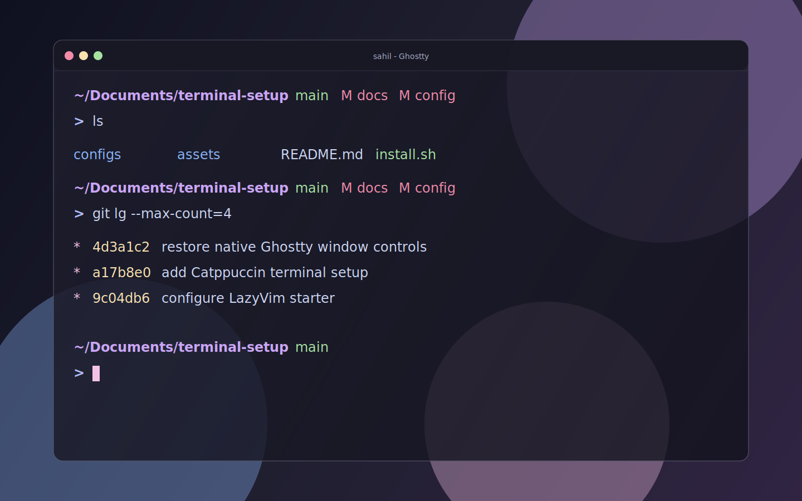

# Terminal Setup — Funky Developer Edition

A curated macOS terminal setup built for aesthetics, productivity, and developer happiness.


## What's Included

| Category | Tool | Purpose |
|----------|------|---------|
| Terminal | [Ghostty](https://ghostty.org) | GPU-accelerated terminal with shaders & transparency |
| Theme | [Catppuccin Mocha](https://github.com/catppuccin) | Consistent theme across all tools |
| Font | [Maple Mono NF](https://github.com/subframe7536/maple-font) | Rounded, modern coding font with Nerd Font icons |
| Shell Prompt | [Starship](https://starship.rs) | Minimal, fast, informative prompt |
| Editor | [Neovim](https://neovim.io) + [LazyVim](https://www.lazyvim.org) | Terminal IDE with LSP, fuzzy finding, git |
| Git TUI | [lazygit](https://github.com/jesseduffield/lazygit) | Full git workflow in a TUI |
| Git Pager | [delta](https://github.com/dandavison/delta) | Syntax-highlighted, side-by-side diffs |
| File Listing | [eza](https://github.com/eza-community/eza) | Modern `ls` with icons & git status |
| File Viewer | [bat](https://github.com/sharkdp/bat) | `cat` with syntax highlighting |
| Fuzzy Finder | [fzf](https://github.com/junegunn/fzf) | Ctrl+R history search, Ctrl+T file search |
| Smart cd | [zoxide](https://github.com/ajeetdsouza/zoxide) | Jump to directories by name |
| Search | [ripgrep](https://github.com/BurntSushi/ripgrep) | Blazing fast grep |
| Markdown | [glow](https://github.com/charmbracelet/glow) | Render markdown in terminal |
| API Client | [posting](https://github.com/darrenburns/posting) | Postman-like TUI |
| Cheatsheets | [navi](https://github.com/denisidoro/navi) | Interactive command cheatsheets |
| Zsh Plugin | zsh-autosuggestions | Ghost text from command history |
| Zsh Plugin | zsh-syntax-highlighting | Colors valid/invalid commands as you type |
| Fun | [cmatrix](https://github.com/abishekvashok/cmatrix) | Matrix rain animation |

## Screenshots



> Preview of the Ghostty + Catppuccin Mocha setup with the native macOS title bar enabled.

## Prerequisites

- macOS (Apple Silicon or Intel)
- [Homebrew](https://brew.sh) installed
- Git installed

## Installation

### 1. Install All Tools

```bash
# Terminal
brew install --cask ghostty

# Font
brew install --cask font-maple-mono-nf

# Shell tools
brew install starship eza bat zoxide fzf ripgrep navi glow cmatrix

# Zsh plugins
brew install zsh-autosuggestions zsh-syntax-highlighting

# Editor
brew install neovim

# Git tools
brew install lazygit git-delta

# API client
brew install posting
```

### 2. Ghostty Config

Create `~/.config/ghostty/config`:

```ini
# ============================================================
#  GHOSTTY CONFIG — Funky Developer Edition
# ============================================================

# === Theme ===
theme = light:Catppuccin Latte,dark:Catppuccin Mocha

# === Font ===
font-family = MapleMono NF
font-size = 13
font-thicken = true
font-feature = +liga
font-feature = +calt
adjust-cell-height = 2

# === Cursor ===
cursor-style = bar
cursor-style-blink = true
cursor-color = #f5c2e7

# === Window & Glass Effect ===
background-opacity = 0.40
background-blur-radius = 40
window-padding-x = 16
window-padding-y = 12
window-padding-balance = true
window-padding-color = background
window-decoration = true
macos-titlebar-style = native
macos-window-buttons = visible
macos-titlebar-proxy-icon = visible
window-colorspace = display-p3
window-inherit-working-directory = true
window-theme = dark

# === Splits & Focus ===
unfocused-split-opacity = 0.7
focus-follows-mouse = true

# === Shell Integration ===
shell-integration = detect
shell-integration-features = cursor,sudo,title

# === Quick Terminal (Drop-Down Quake Style) ===
# Disabled so Ghostty opens as a normal movable macOS window with titlebar buttons.
# keybind = global:ctrl+grave_accent=toggle_quick_terminal
# quick-terminal-position = top
# quick-terminal-animation-duration = 0.15
# quick-terminal-autohide = true

# === Scrollback ===
scrollback-limit = 100000000

# === Clipboard ===
clipboard-read = ask
clipboard-write = allow
clipboard-paste-protection = true

# === Keybindings — Splits ===
keybind = ctrl+shift+enter=new_split:right
keybind = ctrl+shift+d=new_split:down
keybind = ctrl+shift+h=goto_split:left
keybind = ctrl+shift+j=goto_split:bottom
keybind = ctrl+shift+k=goto_split:top
keybind = ctrl+shift+l=goto_split:right

# === Keybindings — Prompt Navigation ===
keybind = ctrl+shift+up=jump_to_prompt:-1
keybind = ctrl+shift+down=jump_to_prompt:1

# === Notifications ===
notify-on-command-finish = unfocused
notify-on-command-finish-after = 10s

# === Shaders ===
custom-shader = ~/.config/ghostty/cursor-shaders/cursor_warp.glsl
custom-shader-animation = always
```

### 3. Install Ghostty Shaders

```bash
git clone --depth 1 https://github.com/hackr-sh/ghostty-shaders ~/.config/ghostty/shaders
git clone --depth 1 https://github.com/sahaj-b/ghostty-cursor-shaders ~/.config/ghostty/cursor-shaders
```

### 4. Starship Prompt

Create `~/.config/starship.toml`:

```toml
"$schema" = 'https://starship.rs/config-schema.json'

format = """
$directory\
$git_branch\
$git_status\
$python\
$nodejs\
$rust\
$golang\
$java\
$docker_context\
$cmd_duration\
$line_break\
$character"""

add_newline = true
palette = 'catppuccin_mocha'

[palettes.catppuccin_mocha]
rosewater = "#f5e0dc"
flamingo = "#f2cdcd"
pink = "#f5c2e7"
mauve = "#cba6f7"
red = "#f38ba8"
maroon = "#eba0ac"
peach = "#fab387"
yellow = "#f9e2af"
green = "#a6e3a1"
teal = "#94e2d5"
sky = "#89dceb"
sapphire = "#74c7ec"
blue = "#89b4fa"
lavender = "#b4befe"
text = "#cdd6f4"
subtext1 = "#bac2de"
subtext0 = "#a6adc8"
overlay2 = "#9399b2"
overlay1 = "#7f849c"
overlay0 = "#6c7086"
surface2 = "#585b70"
surface1 = "#45475a"
surface0 = "#313244"
base = "#1e1e2e"
mantle = "#181825"
crust = "#11111b"

[directory]
style = "bold mauve"
format = '[$path]($style) '
truncation_length = 3
truncation_symbol = ".../"

[git_branch]
symbol = ""
style = "green"
format = '[$symbol $branch]($style) '

[git_status]
style = "red"
format = '[$all_status$ahead_behind]($style) '

[python]
symbol = ""
style = "yellow"
format = '[$symbol $version]($style) '

[nodejs]
symbol = ""
style = "green"
format = '[$symbol $version]($style) '

[rust]
symbol = ""
style = "peach"
format = '[$symbol $version]($style) '

[golang]
symbol = ""
style = "sky"
format = '[$symbol $version]($style) '

[java]
symbol = ""
style = "red"
format = '[$symbol $version]($style) '

[docker_context]
symbol = ""
style = "blue"
format = '[$symbol $context]($style) '

[cmd_duration]
min_time = 500
style = "surface2"
format = '[$duration]($style) '

[character]
success_symbol = '[>](bold lavender)'
error_symbol = '[>](bold red)'

[line_break]
disabled = false
```

### 5. Neovim + LazyVim

```bash
# Clone LazyVim starter
git clone https://github.com/LazyVim/starter ~/.config/nvim
rm -rf ~/.config/nvim/.git
```

Create `~/.config/nvim/lua/config/options.lua`:

```lua
local opt = vim.opt

opt.relativenumber = true
opt.scrolloff = 8
opt.termguicolors = true
opt.cursorline = true
opt.smoothscroll = true
```

Create `~/.config/nvim/lua/plugins/colorscheme.lua`:

```lua
return {
  {
    "catppuccin/nvim",
    name = "catppuccin",
    priority = 1000,
    opts = {
      flavour = "mocha",
      transparent_background = true,
      integrations = {
        cmp = true,
        gitsigns = true,
        treesitter = true,
        mason = true,
        mini = true,
        native_lsp = { enabled = true },
        noice = true,
        notify = true,
        telescope = { enabled = true },
        which_key = true,
      },
    },
  },
  {
    "LazyVim/LazyVim",
    opts = {
      colorscheme = "catppuccin",
    },
  },
}
```

Open `nvim` once to auto-install all plugins.

### 6. Git Config

Add to `~/.gitconfig`:

```ini
[core]
    pager = delta

[interactive]
    diffFilter = delta --color-only

[delta]
    navigate = true
    dark = true
    side-by-side = true
    line-numbers = true
    syntax-theme = Catppuccin Mocha

[merge]
    conflictStyle = zdiff3

[alias]
    lg = log --graph --oneline --all --decorate
```

### 7. Zsh Config

Add to `~/.zshrc`:

```bash
# Modern CLI replacements
alias ls='eza --icons'
alias ll='eza -la --icons --git'
alias lt='eza --tree --icons --level=2'
alias cat='bat --paging=never'
alias grep='rg'

# Zoxide (smart cd)
eval "$(zoxide init zsh)"

# Fzf (fuzzy finder: Ctrl+R for history, Ctrl+T for files)
source <(fzf --zsh)
export FZF_DEFAULT_OPTS='--color=bg+:#313244,bg:#1e1e2e,spinner:#f5e0dc,hl:#f38ba8 --color=fg:#cdd6f4,header:#f38ba8,info:#cba6f7,pointer:#f5e0dc --color=marker:#f5e0dc,fg+:#cdd6f4,prompt:#cba6f7,hl+:#f38ba8'

# Navi (command cheatsheet: Ctrl+G to invoke)
eval "$(navi widget zsh)"

# Zsh plugins
source /opt/homebrew/share/zsh-autosuggestions/zsh-autosuggestions.zsh
source /opt/homebrew/share/zsh-syntax-highlighting/zsh-syntax-highlighting.zsh

# Starship Prompt (must be last)
eval "$(starship init zsh)"
```

## Keybindings

### Ghostty
| Shortcut | Action |
|----------|--------|
| `Ctrl+`` ` | Quick terminal (drop-down) |
| `Ctrl+Shift+Enter` | Split right |
| `Ctrl+Shift+D` | Split down |
| `Ctrl+Shift+H/J/K/L` | Navigate splits |
| `Ctrl+Shift+Up/Down` | Jump between prompts |

### Shell
| Shortcut | Action |
|----------|--------|
| `Ctrl+R` | Fuzzy search command history |
| `Ctrl+T` | Fuzzy find files |
| `Ctrl+G` | Navi command cheatsheet |
| `→` (right arrow) | Accept autosuggestion |

### Neovim (LazyVim)
| Shortcut | Action |
|----------|--------|
| `Space` | Command palette |
| `Space+f+f` | Find files |
| `Space+s+g` | Live grep |
| `Space+e` | File explorer |
| `Space+l+x` | LazyExtras (add languages) |

### lazygit
Run `lazygit` in any git repo. Navigate with `h/j/k/l`.

## CLI Quick Reference

```bash
ls              # File list with icons (eza)
ll              # Detailed list with git status
lt              # Tree view
cat file.py     # Syntax-highlighted file view (bat)
grep "pattern"  # Fast search (ripgrep)
z project       # Smart jump to directory (zoxide)
lazygit         # Git TUI
git lg          # Pretty git log graph
glow README.md  # Render markdown
posting         # API client TUI
cmatrix -C cyan # Matrix rain
```

## Theme Consistency

Everything uses **Catppuccin Mocha** for a unified look:
- Ghostty terminal
- Neovim editor
- Starship prompt
- fzf fuzzy finder
- delta git diffs
- bat syntax highlighting

## Optional Shaders

Uncomment in Ghostty config to enable:

| Shader | Effect |
|--------|--------|
| `bettercrt.glsl` | CRT scanlines |
| `glitchy.glsl` | Digital glitch |
| `inside-the-matrix.glsl` | Matrix rain overlay |
| `starfield-colors.glsl` | Animated starfield |
| `cineShader-Lava.glsl` | Lava lamp background |

## License

This setup is a collection of open-source tools. Each tool retains its own license.
